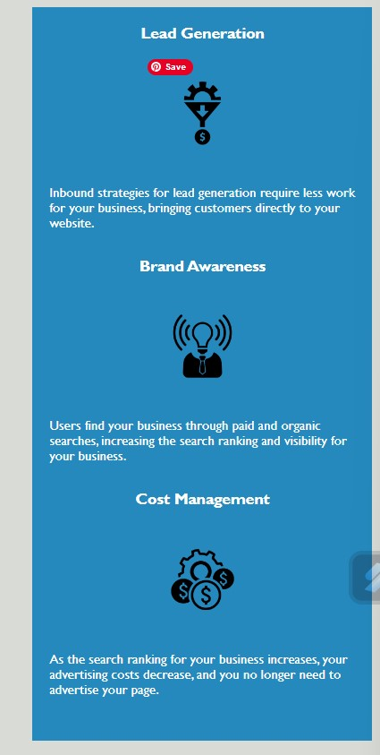

# Horiseon

Accessibility standards and SEO

# Description

This project was handed over by a marketing agency to review/refract the existing code, by following accessibility standars and SEO.

# Instalation

The website page can be accessed [here](https://ionescuea.github.io/Horiseon/index.html).

# Usage

On the main page, there are 3 options on how the company can help.

By clicking the links, you are taken to the relevant information on the web page.

Aside, there is more information on the web page in regards to lead, brand and cost.

# Credits

[BootcampSpot](https://github.com/edx)

[Alexandra Ionescu](https://github.com/ionescuea)

# License

Licensed under the [MIT](LICENSE) license.
